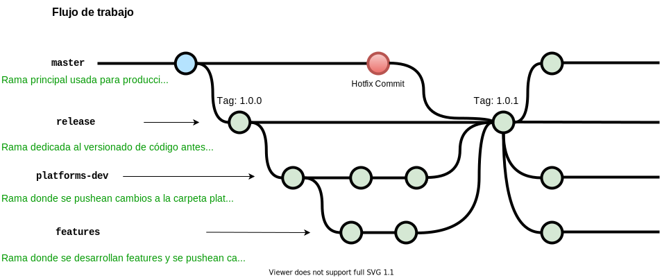

# GitFlow

Gitflow es un proceso que nos permite mantener el código de producción estable, versionarlo, code-review y mantener buenas prácticas de desarrollo.

Nos basamos en la [documentación oficial](https://www.atlassian.com/git/tutorials/comparing-workflows/gitflow-workflow), pero acomodamos esta práctica a nuestras necesidades.

Actualmente los desarrolladores de plataformas solo pueden trabajar sobre la rama **platforms-dev**, el resto de ramas y el código que va a producción lo gestiona el sub-equipo **TS Gitflow**.

En las ramas **platforms-dev** y **features** se debe trabajar en ramas locales y luego hacer merge a la rama donde corresponda (platforms-dev para archivos de la carpeta platforms y el config.yaml, features para nuevos features y cualquier otro archivo que no corresponda a platforms-dev). Se trabaja en ramas locales con el propósito de evitar que a release llegue código sin terminar y así también reducir la cantidad de cambios a revisar en cada versionado.

Para los mensajes de los commits se debería usar el siguiente formato:
- Para añadir un archivo nuevo: git commit -m "Create pepito.py"
- Para modificar un archivo existente: git commit -m "Update pepito.py"
- Para borrar un archivo existente: git commit -m "Delete pepito.py"

<h2 align="left">
  
</h2>

Si hay una nueva rama con un nuevo feature, se debe llamara "feature/algo" y una vez finalizado el feature, comunicarlo al equipo TS GitFlow.

